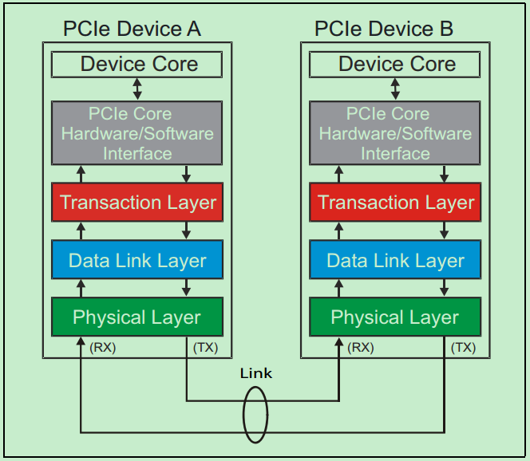

# PCIe总线体系结构

PCIe是一个串行传输协议，一个完整的PCIe体系结构包括**应用层**、**事务层（Transaction Layer）**、**数据链路层（Data Link Layer）**和**物理层（Physical Layer）**
其中，应用层并不是PCIe Spec所规定的内容，完全由用户根据自己的需求进行设计，另外三层都是PCIe Spec明确规范的，并要求设计者严格遵循的。

一个简化的PCIe总线体系结构如上图所示，其中Device Core and interface to Transaction Layer就是我们常说的应用层或者软件层。这一层决定了PCIe设备的类型和基础功能，可以由硬件（如FPGA）或者软硬件协同实现。如果该设备为Endpoint，则其最多可拥有8项功能（Function），且每项功能都有一个对应的配置空间（Configuration Space）。如果该设备为Switch，则应用层需要实现包路由（Packet Routing）等相关逻辑。如果该设备为Root，则应用层需要实现虚拟的PCIe总线0（Virtual PCIe Bus 0），并代表整个PCIe总线系统与CPU通信。
