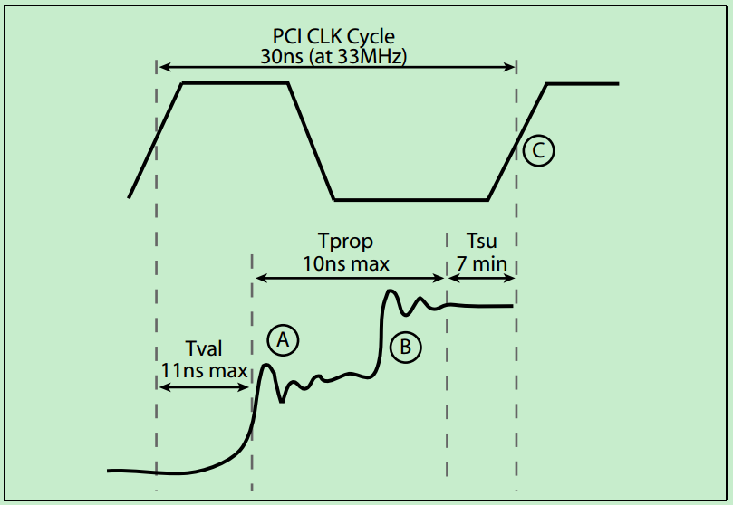
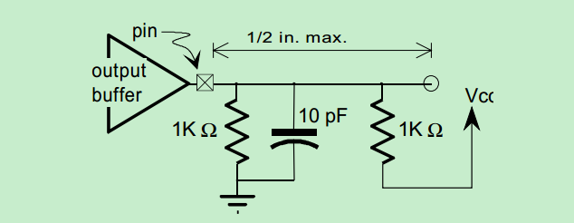
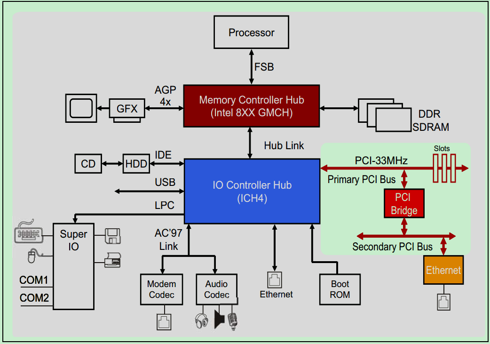

# PCI总线中的Reflected-Wave Signaling 
PCI Spec规定了每个PCI总线上最多可以连接多达32个PCI设备，但是实际上却远远达不到32个，33MHz的32位PCI总线一般只能连接10到12个负载。
注：如果使用插槽连接，则一个连接算两个PCI设备，插槽和PCI卡分别算作一个PCI设备。也就是说一个33MHz的PCI总线最多只能连接4到5个插槽即PCI卡。
这是因为PCI总线在设计的时候，为了降低功耗，采用了一种叫做reflected‐wave signaling的技术，如下图所示：

由图可知，为了降低功耗PCI设备的发送端采用了一种 weak transmit buffers，其只能驱动信号电平达到实际需求的一半。然后依靠反射回来的信号叠加到原本的信号上，使得信号电平达到实际的需求。当然，所有的这些过程都要求在一个时钟周期内完成，这种机制也限制了PCI总线频率的提高，也限制了单个PCI总线上的最大连接设备的数量。如果需要连接更多的PCI设备，则需要借助PCI-to-PCI桥，每个桥的内部都有隔离，这保证了每个桥又可以连接额外的10~12个负载。但是PCI Spec规定了，一个PCI总线系统中，最多只能有256个子总线。
注：熟悉信号完整性分析的朋友应该知道，在高速信号传输中，反射往往会导致信号的形变，使得信号质量变差，误码率变高，甚至信号收发异常，传输中断。然而，在一些特定的领域（比如PCI总线），合理地使用反射机制，可以达到降低功耗等效果。不过，相对于目前的很多高速串行信号，PCI总线算是很慢的信号了，像PCI总线这种利用反射机制降低功耗的，几乎不可能在高速信号得到应用。

此外，PCI总线的Input Buffer还没有加输入寄存器，这对信号的Setup时间提出了更高的要求。

一个包含PCI-to-PCI桥的33MHz PCI总线系统的架构图如下所示：

