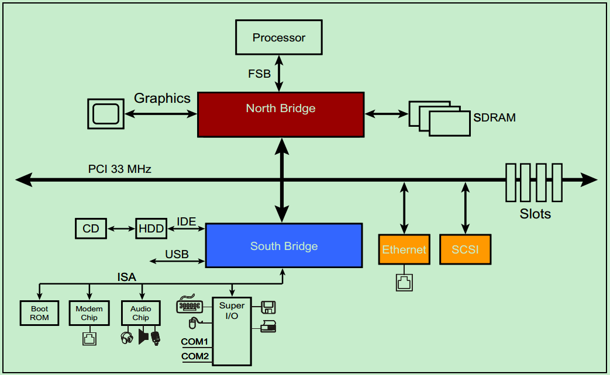
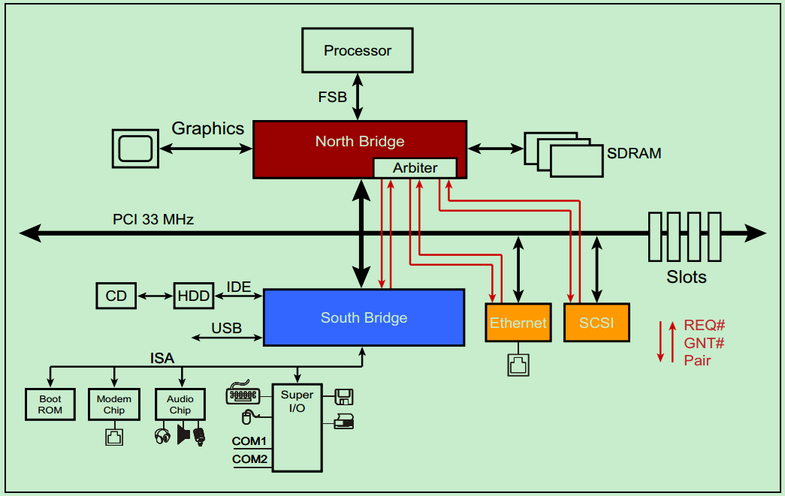
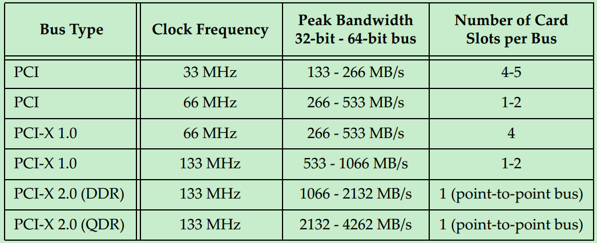

# PCI总线基本概念
PCI是Peripheral Component Interconnect(外设部件互连标准)的缩写，它曾经是个人电脑中使用最为广泛的接口，几乎所有的主板产品上都带有这种插槽。目前该总线已经逐渐被PCI Express总线所取代。

PCI即Peripheral Component Interconnect，中文意思是“外围器件互联”，是由PCISIG (PCI Special Interest Group)推出的一种局部并行总线标准。PCI总线是由ISA(Industy Standard Architecture)总线发展而来的，是一种同步的独立于处理器的32位或64位局部总线。从结构上看，PCI是在CPU的供应商和原来的系统总线之间插入的一级总线，具体由一个桥接电路实现对这一层的管理，并实现上下之间的接口以协调数据的传送。从1992年创立规范到如今，PCI总线已成为了计算机的一种标准总线，广泛用于当前高档微机、工作站，以及便携式微机。主要用于连接显示卡、网卡、声卡。

PCI总线是一种树型结构，并且独立于CPU总线，可以和CPU总线并行操作。PCI总线上可以挂接PCI设备和PCI桥，PCI总线上只允许有一个PCI主设备（同一时刻），其他的均为PCI 从设备，而且读写操作只能在主从设备之间进行，从设备之间的数据交换需要通过主设备中转。

>注：这并不意味着所有的读写操作都需要通过北桥中转，因为PCI总线上的主设备和从设备属性是可以变化的。比如Ethernet和SCSI需要传输数据，可以通过一种叫做Peer-to-Peer的方式来完成，此时Ethernet或者SCSI则作为主机，其它的设备则为从机。具体会在后面的博文中详细介绍。

一个典型的33MHz的PCI总线系统如上图所示，处理器通过FSB与北桥相连接，北桥上挂载着图形加速器（显卡）、SDRAM（内存）和PCI总线。PCI总线上挂载着南桥、以太网、SCSI总线（一种老式的小型机总线）和若干个PCI插槽。CD和硬盘则通过IDE连接至南桥，音频设备以及打印机、鼠标和键盘等也连接至南桥，此外南桥还提供若干的USB接口。

PCI总线是一种共享总线，所以需要特定的仲裁器（Arbiter）来决定当前时刻的总线的控制权。一般该仲裁器位于北桥中，而仲裁器（主机）则通过一对引脚，REQ#（request） 和GNT# （grant）来与各个从机连接。如下图所示：

需要注意的是，并不是所有的设备都有能力成为仲裁器（Arbiter）或者initiator 。

最初的PCI总线的时钟频率为33MHz，但是随着版本的更新，时钟频率也逐渐的提高。但是由于PCI采用的是一种Reflected-Wave Signaling信号模型（后面会详细的介绍），导致了时钟频率越高，总线的最大负载越少，如下图所示

到了PCI-X2.0版本，整个总线就只能插一个PCI卡了（相当于两个PCI负载），为了能够在主板上提供更多的插槽，则必须通过连接多个PCI桥来实现（后面会详细地介绍）。