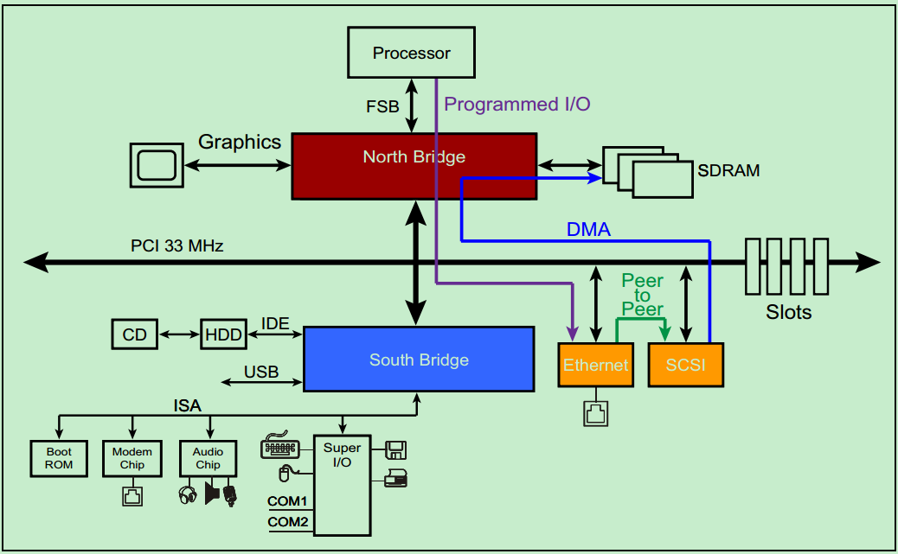

# PCI总线的三种传输模式
本文来简单地介绍一下PCI Spec规定的三种数据传输模型：Programmed I/O（PIO），Peer-to-Peer和DMA。
三种数据传输模型的示意图如下图所示：

## 首先来介绍一下Programmed I/O（PIO）
PIO在早期的PC中被广泛使用，因外当时的处理器的速度要远远大于任何其他外设的速度，所以PIO足以胜任所有的任务。举一个例子，比如说某一个PCI设备需要向内存（SDRAM）中写入一些数据，该PCI设备会向CPU请求一个中断，然后CPU首先先通过PCI总线把该PCI设备的数据读取到CPU内部的寄存器中，然后再把数据从内部寄存器写入到内存（SDRAM）中。

现在看来，这种传输方式的效率还是很低的。首先，每次CPU和PCI设备以及SDRAM通信都需要额外的时钟周期（相对于DMA）；其次，这种传输方式还需要长时间地占用CPU，影响CPU的使用率。试想一下，你在用PC在线观看一个1080p60的高清视频，这需要以太网连续地向内存（SDRAM）中写入数据，如果使用PIO的方式的话，将难以保证数据的写入速度。随着目前的PCI外设速度越来越高，PIO已经逐渐被DMA传输方式所取代，但是为了兼容早期的一些设备，PCI Spec依然保留了PIO。

## DMA，即Direct Memory Access 
DMA是一种在传输过程中，几乎不需要CPU进行干预的数据传输方式。如上面的图片所示，以太网可以直接向内存（SDRAM）中写入数据，而几乎不需要CPU的干预。实际上，DMA不仅仅应用于PCI总线系统中，它是一种更为广泛应用的数据传输方式。目前，几乎所有的CPU，甚至是MCU都支持DMA。具体这里就不详细地介绍了，有兴趣的可以参考百度百科：https://baike.baidu.com/item/DMA/2385376?fr=aladdin或者其它的资料。

## Peer-to-Peer
前面的文章中，我们介绍过PCI总线系统中的主机身份并不是固定不变的，而是可以切换的（借助仲裁器），但是同一时刻只能存在一个主机。完成Peer-to-Peer这一传输方式的前提是，PCI总线系统中至少存在一个有能力成为主机的设备。在仲裁器的控制下，完成主机身份的切换，进而获得PCI总线的控制权，然后与总线上的其他PCI设备进行通信。不过，需要注意的是，在实际的系统中，Peer-to-Peer这一传输方式却很少被使用，这是因为获得主机身份的PCI设备（Initiator）和另一个PCI设备（Target）通常采用不同的数据格式，除非他们是同一个厂家的设备。