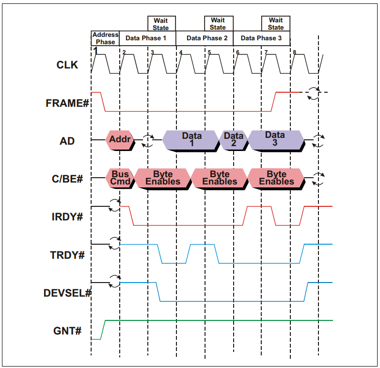

# 一个典型的PCI总线周期
PCI总线是一种地址和数据复用的总线，即地址和数据占用同一组信号线AD。PCI总线的所有信号都与时钟信号同步，及所有的信号的变化都发生在时钟的上升沿，或者在时钟上升沿进行采样。

如下图所示，除了时钟信号CLK和数据地址复用信号AD之外，PCI总线至少还应包括FRAME#（用于表示一次数据传输的起始）、C/BE#（Command/Byte Enable）、IRDY#（Initiator Ready for data）、TRDY#（Target ready）、DESEL#（Device Selec，片选信号，用于选择PCI设备）和GNT#（Grant）信号等。

>完整的信号时序图，请参考PCI Spec。信号名后面的#表示该信号低电平有效。

下面来介绍一个简单的例子，主机接收来自特定从机的数据。

如上图所示：
1. 在第一个时钟上升沿，FRAME#和IRDY#都为inactive，表明总线当前处于空闲状态。与此同时，某个设备的GNT#信号处于active，表明总线总裁器已经选定当前设备为下一个initiator（可以理解为主机）。
1. 在第二个时钟上升沿，FRAME#被initiator拉低，表明新的事务（Transaction）已经开始。与此同时，地址和命令被依次发送到AD上，总线上面的所有其他设备（从机）都会锁存这些信息，并检查地址和命令是否与自己匹配。
1. 在第三个时钟上升沿，IRDY#处于active状态，表明主机准备就绪，可以接收数据了。AD信号上的旋转的箭头表示AD信号目前处于三态状态（处于输出和输入的转换状态），即Turn‐around cycle。需要注意的是，此时的TRDY#应当处于inactive状态，以保证Turn‐around cycle顺利进行。
1. 在第四个时钟上升沿，PCI总线上的某个从机确认身份，并依次将DEVSEL#信号和TRDY#拉低，并将相应的数据输出到AD上。此时，FRAME#信号为active状态，表明这并不是最后一个数据。
1. 在第五个时钟上升沿，TRDY#处于inactive状态，表明从机尚未就绪，因此所有的操作暂缓一个时钟周期（或者说插入了一个Wait State）。PCI总线最多允许8个这样的Wait State。
1. 在第六个时钟上升沿，从机向主机发送第二个数据。此时，FRAME#信号依旧为active状态，表明这并不是最后一个数据。
1. 在第七个时钟上升沿，IRDY#处于inactive状态，表明主机尚未就绪，再次插入一个Wait State。但是此时从机依旧可以向AD上发送数据。
1. 在第八个时钟上升沿，AD上的第三个数据被发送至主机，由于此时FRAME#信号被拉高，即inactive，表明这是本次事务（Transaction）的最后一个数据。此后，所有的控制信号均被拉高，处于inactive状态，AD、FRAME#和C/BE#处于三态状态。